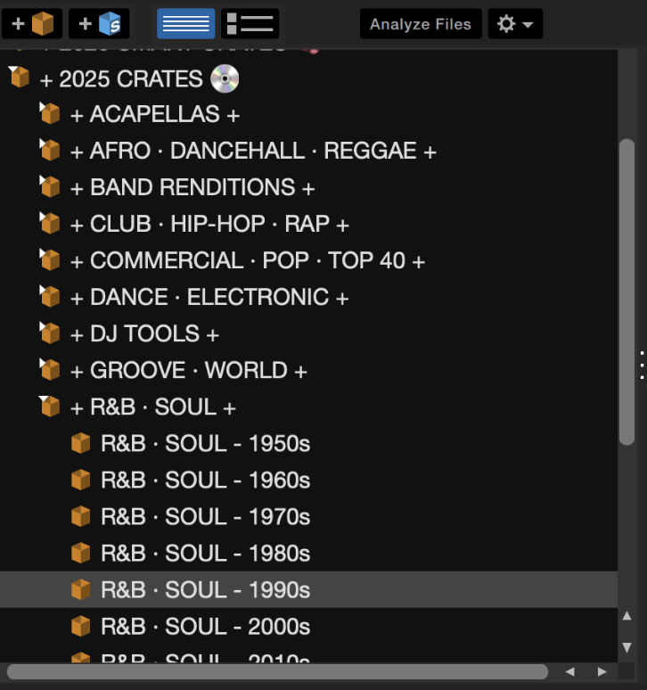
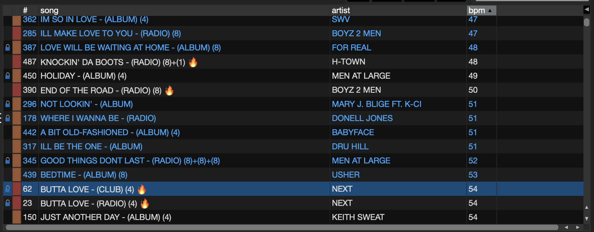
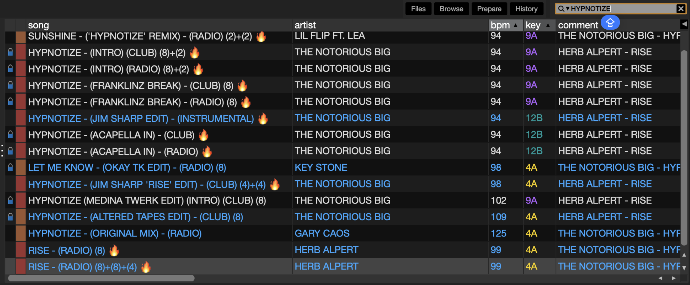

+++
date = '2024-11-18T15:24:17-05:00'
draft = false
title = 'Library Management'
+++

# My Guide to Organizing Your Music Library

**Yo, DJ OKAY TK here.** Been DJing for years, and my music library is sitting around 600 GB deep. That’s thousands of tracks—so having a clean, functional system isn’t just helpful, it’s necessary.

Now, keep in mind—everyone organizes their library differently. Think of it like your kitchen: where you place things depends on your flow. Some people keep the knives by the stove, others by the sink—it’s all about how you cook. Same goes for DJing. This is just how I prep my ingredients, but hopefully a few of these ideas help you sharpen your own setup in Serato.

## Folder Structure: Simple, Structured, All Caps

Everything’s organized by **Genre**, then **Decade**. That’s it. No wild subgenres or over-complications. Simplicity = speed. And when you’re live, speed matters.

**Why decades?** It’s the easiest way to break down large genres by vibe and era. If someone wants a 90s hip-hop set, I can dive straight into Hip Hop > 1990s and go. It also helps me remember the feel of a track. Something from 2003 hits different than something from 2013, even if they’re both in the same genre.

No wild subgenres. Simplicity means speed—and that matters in a live set.

Why decades? It’s an easy, logical way to slice up large genres by era​. If someone asks for a 90s hip hop set, I can jump straight into my Hip Hop > 1990s crate and find gold. It also helps me remember the context of tracks. A song from 2003 has a different vibe than one from 2013, even if they’re both hip hop.

## Smart Tagging: Comments, Grouping & 🔥 Tracks

Every track I add gets tagged properly. I use metadata to my advantage:

- **Comments**:  For remix notes, routine reminders, and sample chains.

- **Grouping**: Tags like `WEDDING`, `MAIN SET`, or `LOUNGE` help me search by vibe.

- **🔥**? That’s for certified floor-fillers. The emoji pops visually—quick glance, instant signal

Also, yeah—**ALL CAPS** on track titles. It's honestly just a personal preference, and just became a habit over time, and keeps the library visually consistent.

### Set Cue Points:

At minimum, I set a cue on the first beat. From there, I’ll usually drop one on the hook or first verse, and another at the chorus. If there’s a bridge or breakdown worth jumping to, I mark that too.

Cue points = options. I’ve seen DJs only set one at the start and mix out after the first chorus. But if you dig deeper, that second verse or bridge might be what levels up your set. Mark it.

## Sample Chaining: Connecting the Dots

If a track samples another, I always log it in the comments. For example:

- **BIGGIE – JUICY** → Comment: `MTUME – JUICY FRUIT`
- **MTUME – JUICY FRUIT** → Comment: `BIGGIE – JUICY`

That way, searching one brings up both. I like connecting those dots—it adds context and opens up creative set ideas.

[WhoSampled.com](https://www.whosampled.com/)  is my go-to for tracing samples. Nerdy? Maybe. But it’s one of the best ways to understand music history—and honestly, I think it makes you a better DJ.
